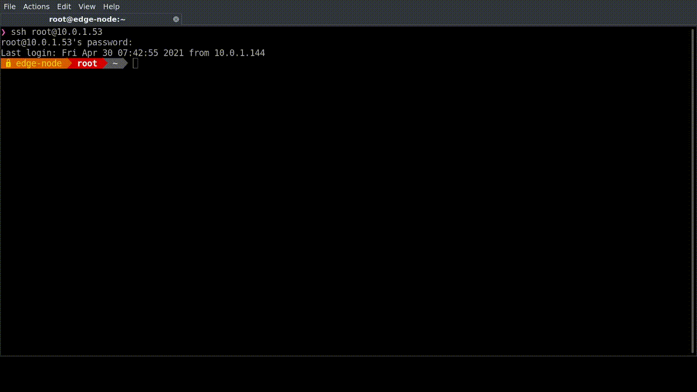
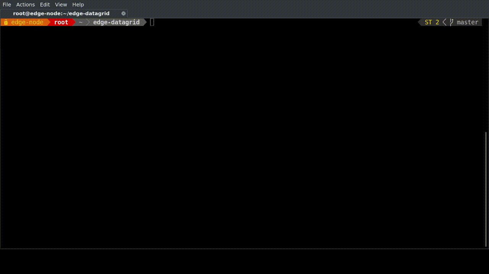
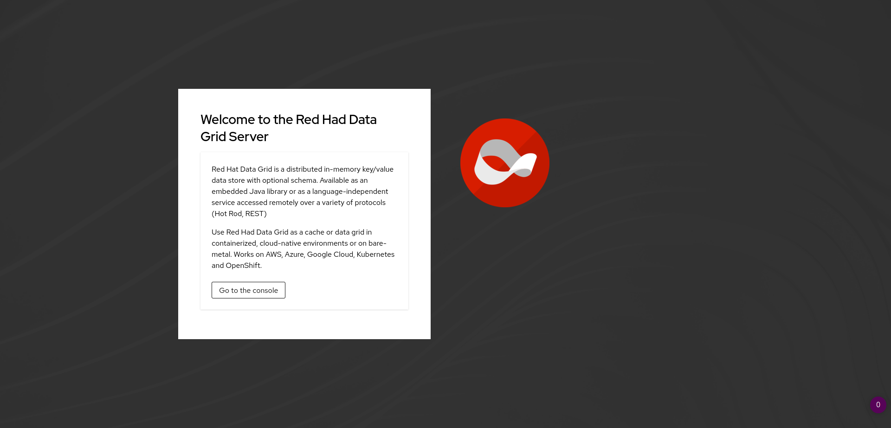

# Edge datagrid
> RHEL EDGE DEMO with datagrid first push




[Configure RHEL 8 system](configure-system.md)


## Initial Steps

### Configure System
**Manual Steps**
* [Manual Steps](configure-system.md)

**Automated Steps** 
```
curl -OL http://gitea.tosins-lab.com:3000/tosin/edge-datagrid/raw/branch/master/build-scripts/configure-system.sh
chmod +x configure-system.sh
./configure-system.sh
```
s
**configure tmux**
```
curl -OL http://gitea.tosins-lab.com:3000/tosin/openstack16.1/raw/branch/master/configure-tmux.sh
chmod +x configure-tmux.sh
./configure-tmux.sh
```

**Clone Git Repo**
```
git clone http://gitea.tosins-lab.com:3000/tosin/edge-datagrid.git
```
**Build Deployment**
```
cd  edge-datagrid
./build-scripts/build.sh 
```

**Teardown Deployment**
```
cd  edge-datagrid
./build-scripts/teardown.sh 
```
**Test deployment**
```
```

**Container for testing**
```
 ./test-container/build-test-container.sh
podman run -it -d  --network rhel-edge fedora /bin/bash 
```

**To access DATAGRID**

* from browser hostip:8080
```
$ podman port -l
11222/tcp -> 0.0.0.0:8080

$ curl -I 127.0.0.1:8080
HTTP/1.1 405 Method Not Allowed
content-length: 11
```

Links: 
* https://www.redhat.com/sysadmin/compose-podman-pods
* [ref-docker-compose](https://stephennimmo.com/ref-docker-compose/)
* https://www.redhat.com/sysadmin/container-networking-podman
* https://developers.redhat.com/blog/2019/01/15/podman-managing-containers-pods/
* https://pcp.io/docs/lab.containers.html
* https://catalog.redhat.com/software/containers/rhel8/pcp/5ede9923bed8bd4f99c6d912takinosh

