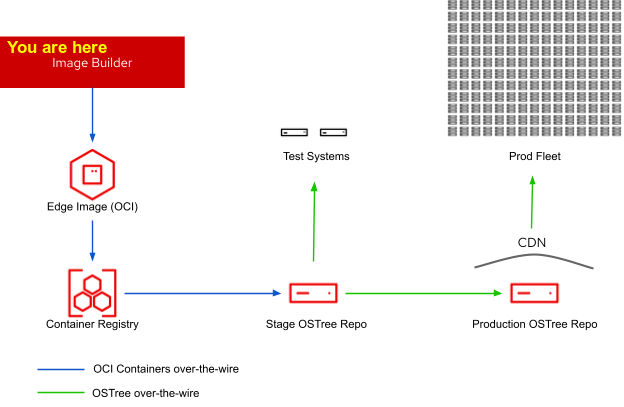

# RHEL Edge Application collection
> This repo a collection of scripts that will deploy applications for RHEL edge deployments.

You are here in the Edge Deployment Process

 
*Source:* [RHEL for Edge: What's new in RHEL 8.5]https://www.redhat.com/en/blog/whats-new-rhel-85)

## Tested Against
```
$ podman -v 
podman version 4.0.2

$ cat /etc/redhat-release 
Red Hat Enterprise Linux release 8.5 (Ootpa)
```

## To-Do's  
* add ansible playbooks for build-script and generator scripts
* add script to generate pods yaml files
* add script to generate systemd-unit files
* add Ansible tower for pipeline deployment  to remote sites
* Use  [rhel-edge-automation-arch](https://github.com/redhat-cop/rhel-edge-automation-arch) to build images from current repo

## Initial Steps

### Configure System
**Configure sudo user**  
*run as root*
```
curl -OL https://raw.githubusercontent.com/tosin2013/rhel-edge-application-collection/main/build-scripts/setup-sudo-user.sh
chmod +x setup-sudo-user.sh
./setup-sudo-user.sh username
```

**Manual Steps**
* [Configure RHEL 8 system](configure-system.md)

**Automated Steps** 
```
curl -OL https://raw.githubusercontent.com/tosin2013/rhel-edge-application-collection/main/build-scripts/configure-system.sh
chmod +x configure-system.sh
./configure-system.sh
```

## To start deploying applications

**Clone Git Repo**
```
git clone https://github.com/tosin2013/rhel-edge-application-collection.git
```

**cd into folder**
```
cd rhel-edge-application-collection
```

## Supported Applications 
-------
### Postgresql and pgadmin4
[PostgreSQL](build-scripts/applications/postgresql/README.md) is a powerful, open source object-relational database system with over 30 years of active development that has earned it a strong reputation for reliability, feature robustness, and performance.

### Grafana
[Grafana](build-scripts/applications/pcp/README.md) is a multi-platform open source analytics and interactive visualization web application.

### Datagrid
[Red Hat Data Grid](build-scripts/applications/datagrid/README.md) Red Hat® Data Grid is an in-memory, distributed, NoSQL datastore solution. Your applications can access, process, and analyze data at in-memory speed to deliver a superior user experience.

### quarkuscoffeeshop-majestic-monolith
[ quarkuscoffeeshop-majestic-monolith](build-scripts/applications/quarkuscoffeeshop-majestic-monolith/README.md)


## Testing container
```
$ ./test-container/build-test-container.sh
podman run -it -d  --network rhel-edge fedora /bin/bash 
```

## Teardown single pod
```
cd  rhel-edge-application-collection
./build-scripts/teardown-pod.sh
```

## Teardown all pods
```
cd  rhel-edge-application-collection
./build-scripts/teardown-all-pods.sh
```

## RHEL Edge Image Builder
*Configure manchine to create builder image (blueprint) script wip*
```
#./build-images/image-builder.sh
```
Follow 
[CREATING SYSTEM IMAGES WITH IMAGE BUILDER COMMAND-LINE INTERFACE](https://access.redhat.com/documentation/en-us/red_hat_enterprise_linux/8/html/composing_a_customized_rhel_system_image/creating-system-images-with-composer-command-line-interface_composing-a-customized-rhel-system-image) to create blueprint based of your image.  

**Build on Single node**
* [Build quarkuscoffeeshop-majestic-monolith on singlenode box](image-builder)

**Build in OpenShift STILL TESTING**
> Work in Progress
* Fork [rhel-edge-automation-arch](https://github.com/redhat-cop/rhel-edge-automation-arch) repo
* Create kickstart File
```
# export GITREPO="https://github.com/tosin2013/rhel-edge-automation-arch.git"
# export APPNAME=quarkuscoffeeshop-majestic-monolith 
# ./build-images/generate-kickstart.sh
```
* add the blueprint file to rhel-edge-automation-arch repo  
*script comming soon*
```
cd $HOME/rhel-edge-automation-arch
git checkout blueprints
export APPNAME=quarkuscoffeeshop-majestic-monolith 
mkdir -p quarkuscoffeeshop-majestic-monolith 
# copy blueprint to directory with the name blueprint.toml
# add and push to your repo
```

* Configure rfe pipeline in OpenShift


## Links: 
* https://developers.redhat.com/blog/2019/05/08/red-hat-enterprise-linux-8-image-builder-building-custom-system-images
* https://www.redhat.com/sysadmin/compose-podman-pods
* [ref-docker-compose](https://stephennimmo.com/ref-docker-compose/)
* https://www.redhat.com/sysadmin/container-networking-podman
* https://developers.redhat.com/blog/2019/01/15/podman-managing-containers-pods/
* https://pcp.io/docs/lab.containers.html
* https://www.redhat.com/en/blog/examining-container-performance-rhel-8-pcp-and-pdma-podman
* https://www.redhat.com/en/blog/working-linux-containers-rhel-8-podman-image-builder-and-web-console

