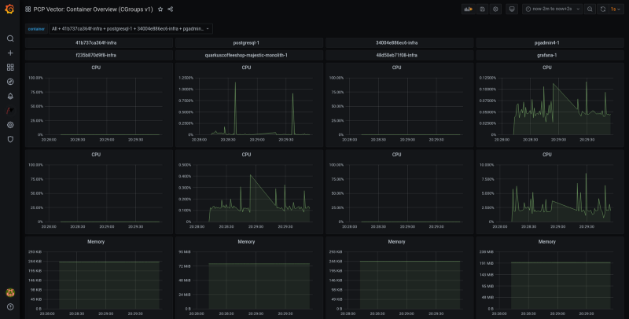
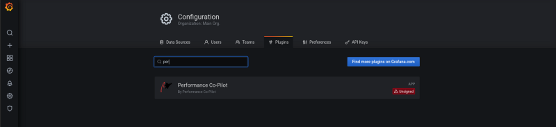
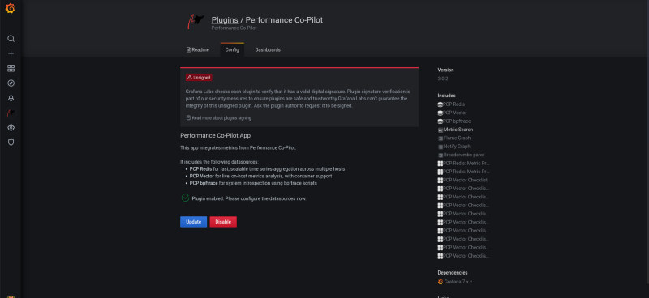
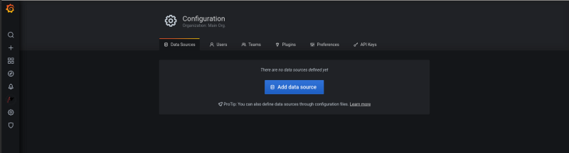
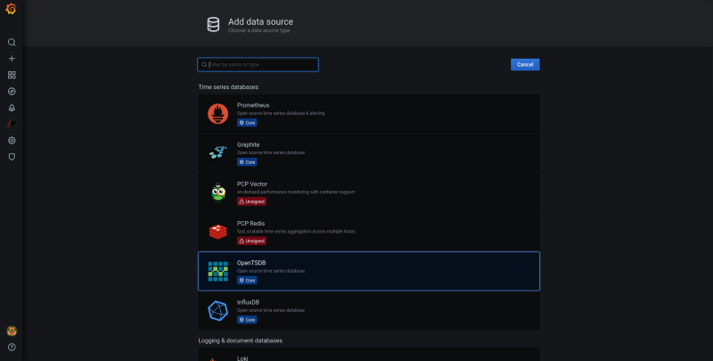
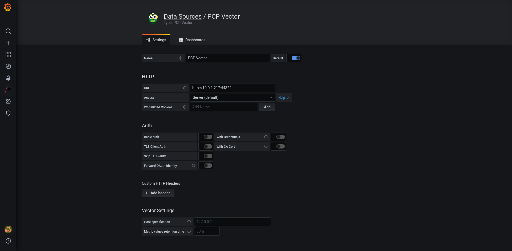

# Grafana Dashboard for Performance Co-Pilot
  
[Grafana](https://grafana.com/) is a multi-platform open source analytics and interactive visualization web application. [Wikipedia](https://en.wikipedia.org/wiki/Grafana)  
[Performance Co-Pilot](https://pcp.io/) is an open source software infrastructure for monitoring, visualizing, recording, responding to, and controlling the status, activity, and performance of networks, computers, applications, and servers. [Wikipedia](https://en.wikipedia.org/wiki/Performance_Co-Pilot)

**Edit Source file:**
```
vi build-scripts/applications/pcp/app_env
```

**Change EXTERNAL_ENDPOINT**
*the fqdn or ip may be used*
```
export EXTERNAL_ENDPOINT="192.168.1.10"
or 
export EXTERNAL_ENDPOINT="rhel-edge.example.com"
```

**Set  ENABLE_PCP to true**
```
export ENABLE_PCP=true
```


**Deploy Grafana for Perfomrance Co-Pilot**
```
./build-scripts/applications/pcp/performancecopilot.sh
```

## POST STEPS
**Access `http://your-ip-address:3000` in web browser**  


**Change default password. The default username and password is `admin:admin` this can be changed at login.**

**Install performance co-pilot**

*Search for performance co-pilot*   


*Enable performance co-pilot*  


*Add PCP Vector as datacource*  



*Add `http://your-ip-address:44322` under url and save*  


**You an now view dashboards**  
  
