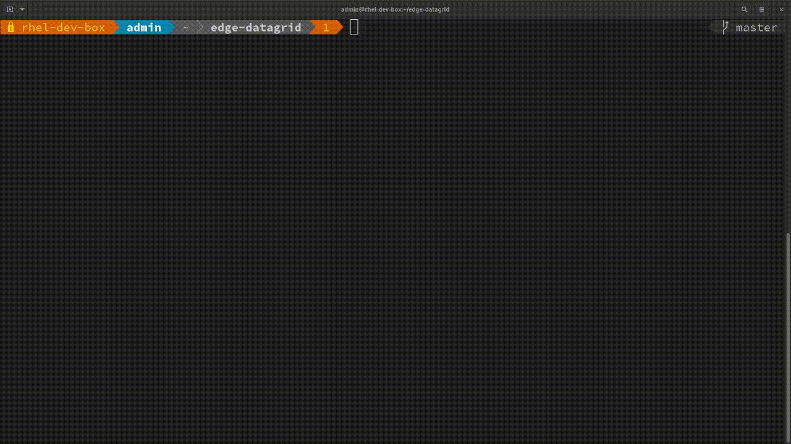

# quarkuscoffeeshop-majestic-monolith

[quarkuscoffeeshop-majestic-monolith](https://github.com/jeremyrdavis/quarkuscoffeeshop-majestic-monolith)  This project uses Quarkus, the Supersonic Subatomic Java Framework. https://quarkuscoffeeshop.github.io/


Ansible Deployments
--------------------
**For Ansible deployment see**
[quarkuscoffeeshop-majestic-monolith](https://github.com/tosin2013/quarkuscoffeeshop-majestic-monolith-ansible)

Local Deployments using internal scripts
----------------------------------------
### Requirements 
* [PostgreSQL](../../applications/postgresql/README.md)
* [Performance Co-Pilot](../../applications/pcp/README.md)  
> To enable podman performance co-pilot add the variable below.
```
export ENABLE_PCP=true
```

**When Deploying PostgreSQL use the variables**
```
export DATABASE_NAME="coffeeshopdb"
export DATABASE_PASSWORD="redhat-21"
export DATABASE_USER="coffeeshopuser"
```

**Edit Source file:**
```
vi build-scripts/applications/quarkuscoffeeshop-majestic-monolith/app_env
```

**Change EXTERNAL_ENDPOINT**
*the fqdn or ip may be used*
```
export EXTERNAL_ENDPOINT="192.168.1.10"
or 
export EXTERNAL_ENDPOINT="rhel-edge.example.com"
```

**Enable podman auto-update function**
[podman-auto-update](http://docs.podman.io/en/latest/markdown/podman-auto-update.1.html#:~:text=podman%20auto%2Dupdate%20looks%20up,the%20image%20has%20been%20updated.)
```
export AUTOUPDATE_CONTAINER=true
export CONTAINER_TAG="latest"
```


**Run build script**
```
 ./build-scripts/applications/quarkuscoffeeshop-majestic-monolith/quarkuscoffeeshop-majestic-monolith.sh 
```

**Optional: Generate service file and kickstart file**
```
# export GITREPO="https://github.com/username/rhel-edge-automation-arch.git"
# export APPNAME=quarkuscoffeeshop-majestic-monolith 
# ./build-images/generate-kickstart.sh
```


### Podman auto update steps
1. Update image to latest in quay registry
2. run the podman auto-update command 
3. Verify image has been updated
